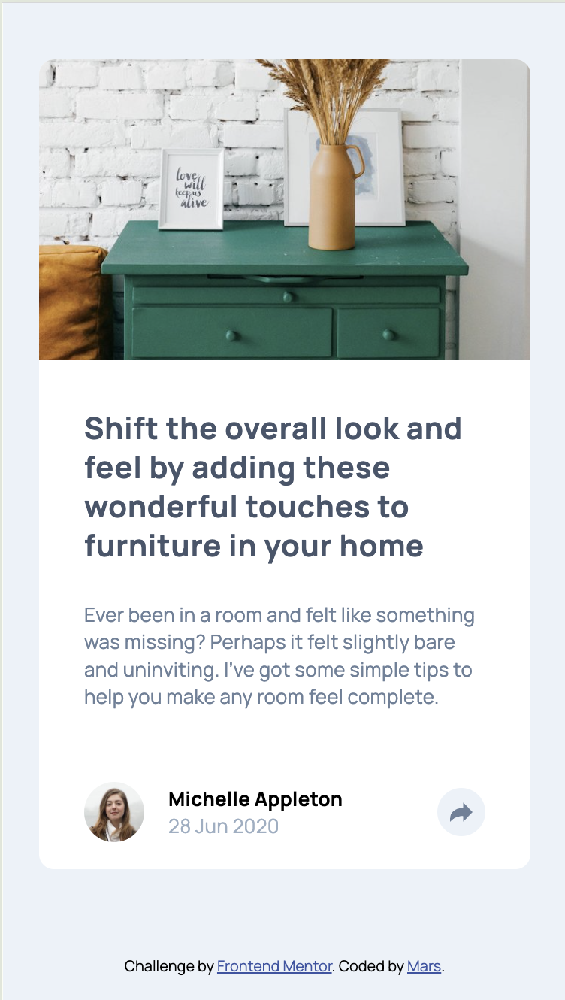
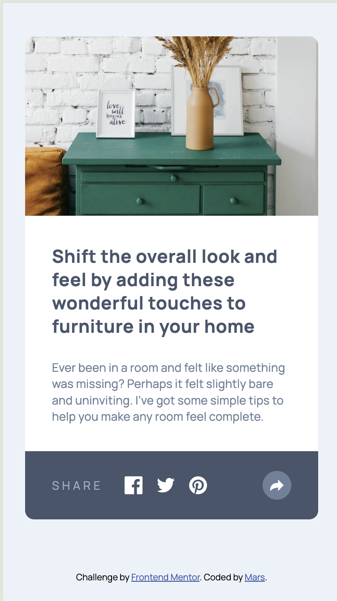
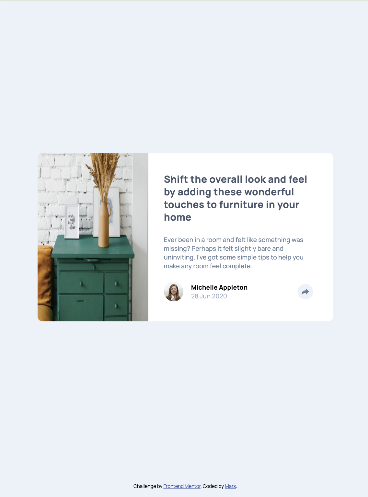
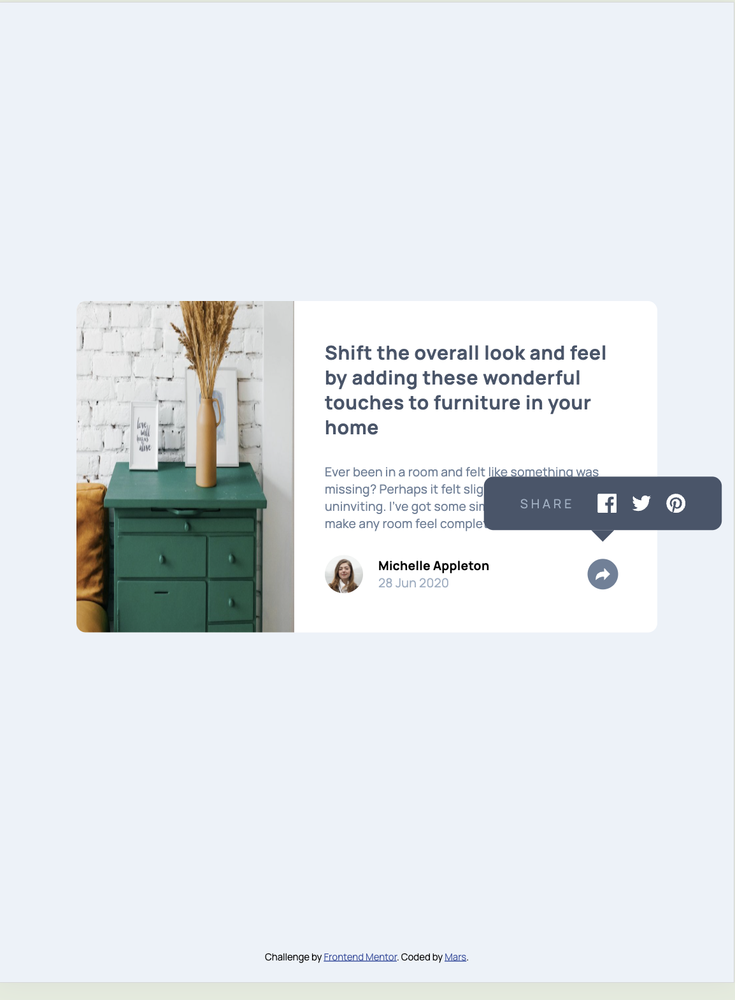
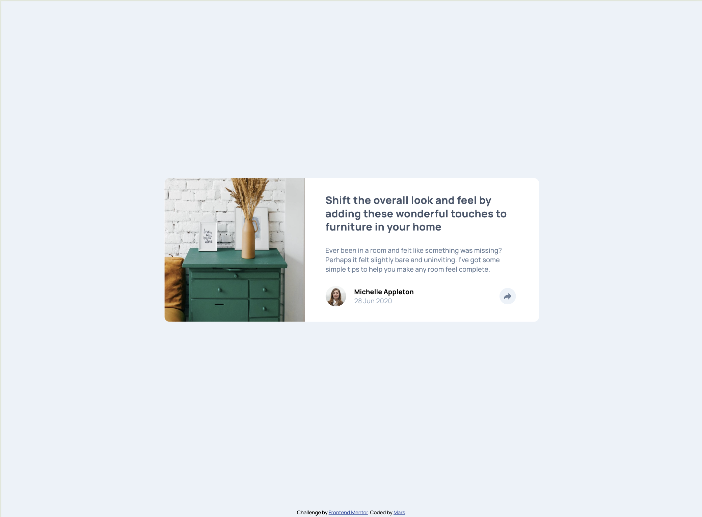
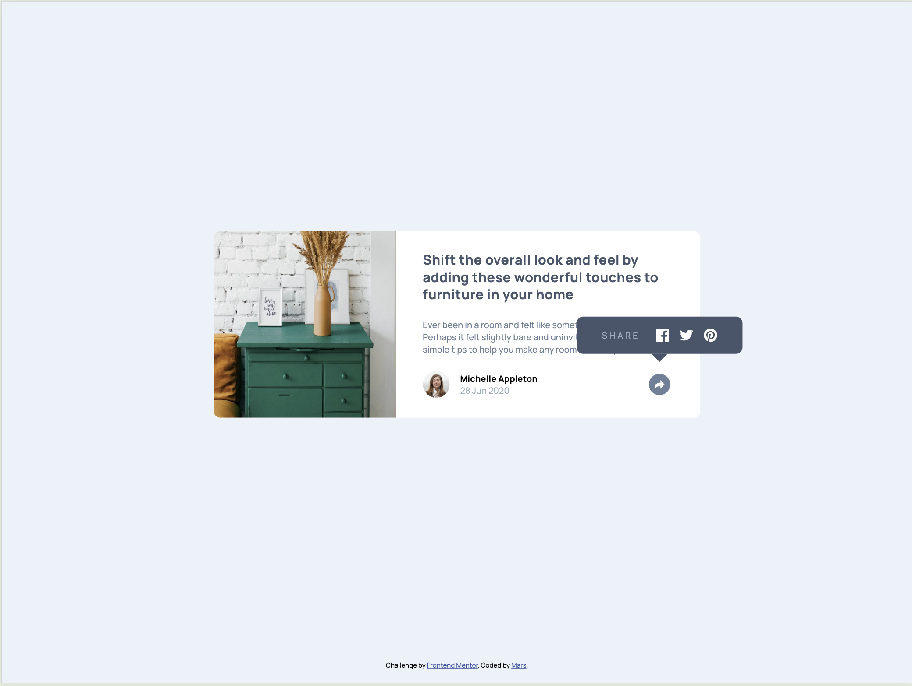

# Frontend Mentor - Article preview component solution

This is a solution to the [Article preview component challenge on Frontend Mentor](https://www.frontendmentor.io/challenges/article-preview-component-dYBN_pYFT). Frontend Mentor challenges help you improve your coding skills by building realistic projects.

## Table of contents

- [Overview](#overview)
  - [The challenge](#the-challenge)
  - [Screenshots](#screenshots)
  - [Links](#links)
- [My process](#my-process)
  - [Built with](#built-with)
  - [What I learned](#what-i-learned)
  - [Continued development](#continued-development)
  - [Useful resources](#useful-resources)
- [Author](#author)

## Overview

### The challenge

Users should be able to:

- View the optimal layout for the component depending on their device's screen size
- See the social media share links when they click the share icon

### Screenshots

#### Mobile View

  
  

#### Tablet View

  
  

#### Desktop View

  
  

### Links

- Solution URL: [Add solution URL here](https://github.com/martinianol/article-preview-component)
- Live Site URL: [Add live site URL here](https://martinianol.github.io/article-preview-component/)

## My process

### Built with

- Semantic HTML5 markup
- SCSS
- BEM
- Mobile-first workflow
- Vanilla JS (recommended by FE mentor to grasp an idea of how it works)

### What I learned

In this project, I improved my understanding of BEM methodology to write scalable and maintainable CSS. I learned how to use Flexbox and CSS Grid effectively to create a responsive layout that adapts well across different screen sizes. Handling dynamic UI elements, such as the tooltip, helped me refine my JavaScript event handling and resize event optimizations.
Lastly, debugging window.innerWidth inconsistencies in Chrome DevTools gave me deeper insights into browser behavior and responsive design challenges.

## Author

- Frontend Mentor - [@martinianol](https://www.frontendmentor.io/profile/martinianol)
- GitHub - [martinianol](https://github.com/martinianol)
